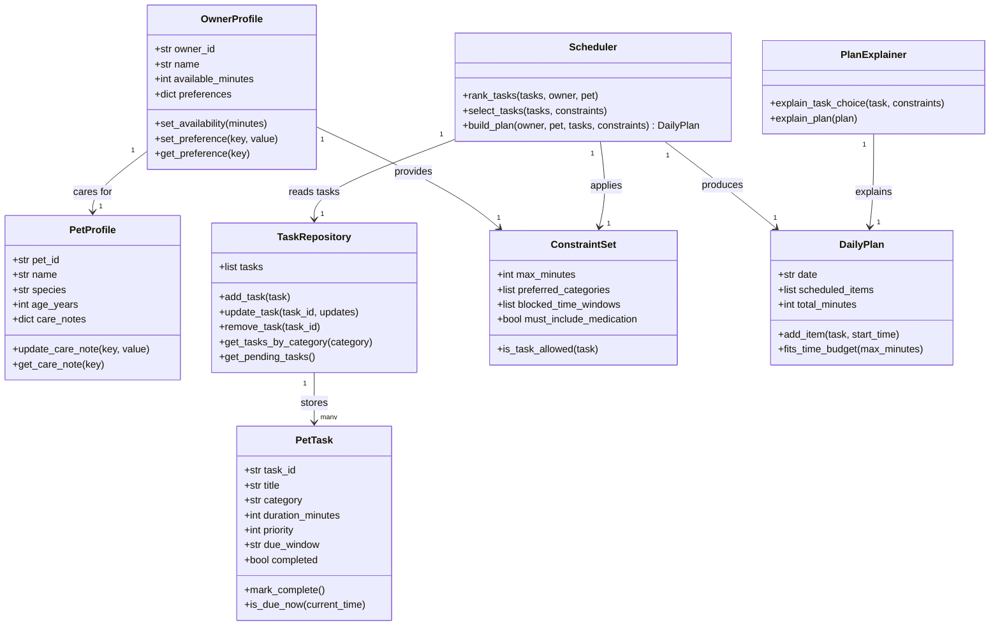

# PawPal+ Project Reflection

## 1. System Design

**a. Initial design**

- My initial UML design separated data objects (Owner, Pet, PetTask) from orchestration objects (TaskRepository, Scheduler, PlanExplainer, DailyPlan).
- The owner profile stores available time and preferences, and the pet profile stores species-specific care notes.
- Tasks are represented as structured objects (category, duration, priority, optional due time), and are inserted/updated through a repository.
- Scheduler evaluates constraints (minutes available, priority, owner preferences, due windows) to generate a feasible daily plan.
- PlanExplainer generates human-readable reasons for why each task was chosen and ordered.

**b. Design changes**

- ## Did your design change during implementation?
  -
- ## If yes, describe at least one change and why you made it.
  -

---

## 2. Scheduling Logic and Tradeoffs

**a. Constraints and priorities**

- What constraints does your scheduler consider (for example: time, priority, preferences)?
- How did you decide which constraints mattered most?

**b. Tradeoffs**

- Describe one tradeoff your scheduler makes.
- Why is that tradeoff reasonable for this scenario?

---

## 3. AI Collaboration

**a. How you used AI**

- How did you use AI tools during this project (for example: design brainstorming, debugging, refactoring)?
- What kinds of prompts or questions were most helpful?

**b. Judgment and verification**

- Describe one moment where you did not accept an AI suggestion as-is.
- How did you evaluate or verify what the AI suggested?

---

## 4. Testing and Verification

**a. What you tested**

- What behaviors did you test?
- Why were these tests important?

**b. Confidence**

- How confident are you that your scheduler works correctly?
- What edge cases would you test next if you had more time?

---

## 5. Reflection

**a. What went well**

- What part of this project are you most satisfied with?

**b. What you would improve**

- If you had another iteration, what would you improve or redesign?

**c. Key takeaway**

- What is one important thing you learned about designing systems or working with AI on this project?
