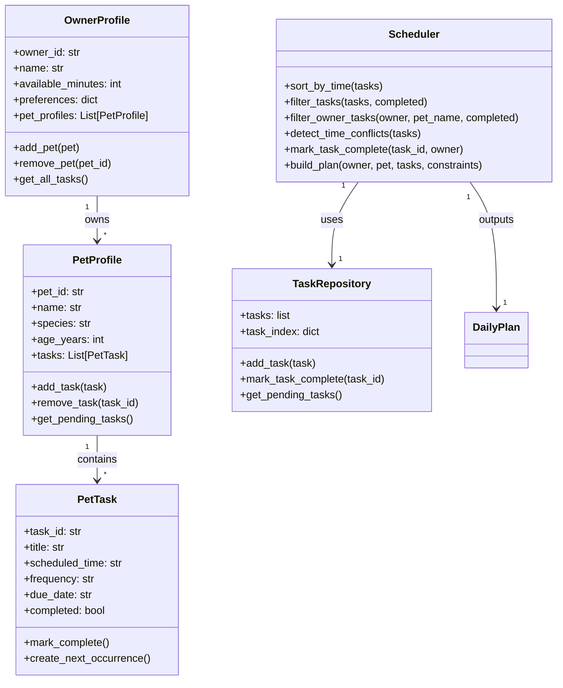

# PawPal+ Project Reflection

## 1. System Design

**a. Initial design**

- My initial UML design separated data objects (Owner, Pet, PetTask) from orchestration objects (TaskRepository, Scheduler, PlanExplainer, DailyPlan).
- The owner profile stores available time and preferences, and the pet profile stores species-specific care notes.
- Tasks are represented as structured objects (category, duration, priority, optional due time), and are inserted/updated through a repository.
- Scheduler evaluates constraints (minutes available, priority, owner preferences, due windows) to generate a feasible daily plan.
- PlanExplainer generates human-readable reasons for why each task was chosen and ordered.

**b. Design changes**

- ## Did your design change during implementation?
  - Yes. I made a few structural adjustments after turning the UML into code.
- ## If yes, describe at least one change and why you made it.
  - I made the UML relationships explicit in code by adding `pet_profile` and `constraints` references to `OwnerProfile`, and by giving `Scheduler` a `task_repository` (plus optional default constraints) through its constructor. This keeps the object graph clear and matches the diagram's one-to-one associations instead of relying only on method parameters.
  - I also added a `task_index` dictionary inside `TaskRepository` keyed by `task_id`. Even in a skeleton, this highlights an implementation direction that avoids repeated linear scans for update/remove operations as task count grows.
  - I added an optional `plan` reference in `PlanExplainer` so the "explains DailyPlan" relationship can be represented either as a passed argument or as a held association.

---

## 2. Scheduling Logic and Tradeoffs

**a. Constraints and priorities**

- What constraints does your scheduler consider (for example: time, priority, preferences)?
- How did you decide which constraints mattered most?

- The scheduler considers total available minutes, task priority, owner category boosts, blocked windows, preferred categories, completion status, and scheduled time ordering.
- I prioritized constraints that directly impact day-to-day usability for a pet owner: first feasibility (time budget), then urgency (priority), then organization/readability (chronological ordering and conflict visibility).

**b. Tradeoffs**

- Describe one tradeoff your scheduler makes.
- Why is that tradeoff reasonable for this scenario?

- The scheduler currently uses lightweight conflict detection by warning only when two tasks share the exact same `HH:MM` start time, rather than calculating full overlap windows using duration.
- This tradeoff keeps the algorithm easy to understand and fast for a student project while still catching the most obvious double-bookings; deeper overlap checks can be added later if needed.

---

## 3. AI Collaboration

**a. How you used AI**

- How did you use AI tools during this project (for example: design brainstorming, debugging, refactoring)?
- What kinds of prompts or questions were most helpful?

- I used Copilot to scaffold class implementations, propose algorithm increments (sorting/filtering/recurrence/conflict detection), and generate/update tests as features evolved.
- The most effective prompts were specific and constraint-driven, for example: "add recurrence when task is marked complete" and "write tests that verify chronological ordering and same-time conflict warnings."

**b. Judgment and verification**

- Describe one moment where you did not accept an AI suggestion as-is.
- How did you evaluate or verify what the AI suggested?

- I rejected a more compact but less readable conflict-detection rewrite that used dense grouping logic. I kept the explicit dictionary-based version because it was easier to reason about and debug.
- I verified decisions by running the CLI demo and `pytest`, then checking whether warnings and outputs matched expected behavior in realistic multi-pet scenarios.

---

## 4. Testing and Verification

**a. What you tested**

- What behaviors did you test?
- Why were these tests important?

- I tested chronological sorting, filtering by pet/status, daily recurrence generation after completion, conflict detection for duplicate times, and empty-task edge cases.
- These tests were important because they cover both user-visible behavior and algorithmic correctness for the "smart scheduler" features.

**b. Confidence**

- How confident are you that your scheduler works correctly?
- What edge cases would you test next if you had more time?

- I am confident at a 4/5 level given passing tests and manual CLI/UI validation.
- Next edge cases: invalid time formats, three or more conflicts at one time, weekly recurrence rollover across months, and overlap detection based on duration (not just exact start time).

---

## 5. Reflection

**a. What went well**

- What part of this project are you most satisfied with?

- I am most satisfied with separating responsibilities cleanly across `TaskRepository`, `Scheduler`, and `PlanExplainer`, then exposing those same capabilities in both CLI and Streamlit.

**b. What you would improve**

- If you had another iteration, what would you improve or redesign?

- In another iteration, I would add overlap-aware conflict detection, stronger validation around time/date input, and fuller task-editing controls in the Streamlit UI.

**c. Key takeaway**

- What is one important thing you learned about designing systems or working with AI on this project?

- The key takeaway is that AI is strongest when treated as a rapid implementation partner, but the human still needs to act as lead architect by setting constraints, evaluating tradeoffs, and deciding when readability should win over compactness.

## AI Workflow Note

- Using separate chat sessions by phase (core classes, UI wiring, algorithms, testing, and final polish) reduced context switching and helped keep each prompt focused on one objective.
- The most effective Copilot features for this project were Agent Mode for multi-step code edits, Ask mode for algorithm clarification, and test generation for fast verification loops.
